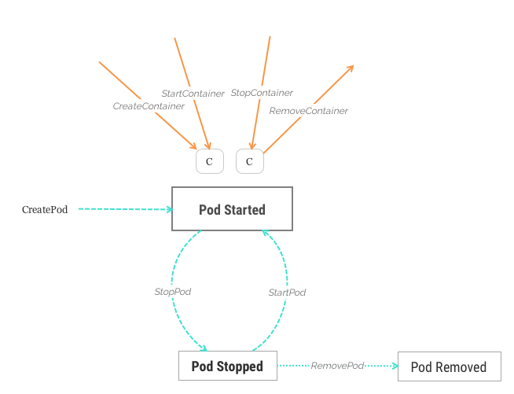

# Lifecycle

> Since v0.8, HyperContainer simplified the model (and the state machine), we won't maintain Pod and VM lifecycle independently any more.

In HyperContainer, a Pod is encapsulated in a VM. A Pod can be launched either explicitly:

	➜ sudo ./hyperctl run -p podfile.json

Or, implicitly:

	➜ sudo ./hyperctl run -d nginx
	POD id is nginx-8530075287

In both cases, Pods and VMs are indivisible. Hyper will automatically provision a new VM instance to host the Pod, and the Pod will be `Running`. There may be zero, one, or more containers in a Pod. And you may create, start, stop, and remove containers in/from a Pod.

	➜ sudo ./hyperctl create -c -d nginx-8530075287 busybox
	Container ID is a8fd34f686e6587979936df880b9e9144fefd895d19560493d2028aa82c47f0c
	➜ sudo ./hyperctl list container
	Container ID                                                       Name                 POD ID              Status
	6e8c08420389a165682586380fa35432f5922287b9aec34059ed1ff68b3f1623   nginx-8530075287     nginx-8530075287    running
	a8fd34f686e6587979936df880b9e9144fefd895d19560493d2028aa82c47f0c   busybox-2602968228   nginx-8530075287    pending
	➜ sudo ./hyperctl start -c busybox-2602968228
	Successfully started container busybox-2602968228
	➜ sudo ./hyperctl list container
	Container ID                                                       Name                 POD ID              Status
	a8fd34f686e6587979936df880b9e9144fefd895d19560493d2028aa82c47f0c   busybox-2602968228   nginx-8530075287    running
	6e8c08420389a165682586380fa35432f5922287b9aec34059ed1ff68b3f1623   nginx-8530075287     nginx-8530075287    running
	➜ sudo ./hyperctl stop -c busybox-2602968228 nginx-8530075287
	➜ sudo ./hyperctl list container
	Container ID                                                       Name                 POD ID              Status
	6e8c08420389a165682586380fa35432f5922287b9aec34059ed1ff68b3f1623   nginx-8530075287     nginx-8530075287    succeeded
	a8fd34f686e6587979936df880b9e9144fefd895d19560493d2028aa82c47f0c   busybox-2602968228   nginx-8530075287    succeeded
	➜ sudo ./hyperctl rm -c busybox-2602968228 nginx-8530075287
	container busybox-2602968228 is successfully deleted!
	container nginx-8530075287 is successfully deleted!
	➜ sudo ./hyperctl list container
	Container ID        Name                POD ID              Status
	➜ sudo ./hyperctl list
	POD ID              POD Name            VM name             Status
	nginx-8530075287    nginx-8530075287    vm-pqEnBvQVdS       running

And you could stop or remove the Pod.

	➜ sudo ./hyperctl rm nginx-8530075287
	Pod(nginx-8530075287) is successfully deleted!
